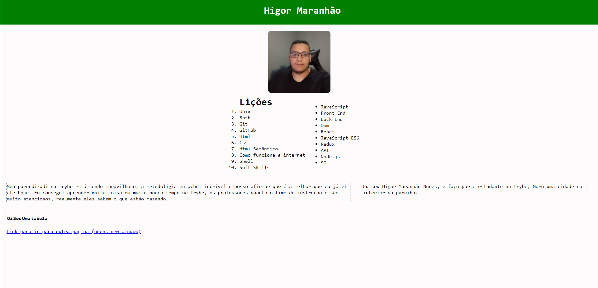

# Boas-vindas ao repositório do projeto de Lições Aprendidas!

<strong>🧑‍💻 O que foi desenvolvido</strong>
 

Desenvolver um site que contenha uma série de informações sobre o que você aprendeu aqui na Trybe ao longo dos primeios três blocos. O seu site deverá estar com elementos posicionados e estilizados e, além disso, deverá conter semântica apropriada para que seja acessível e melhor ranqueado.

 

